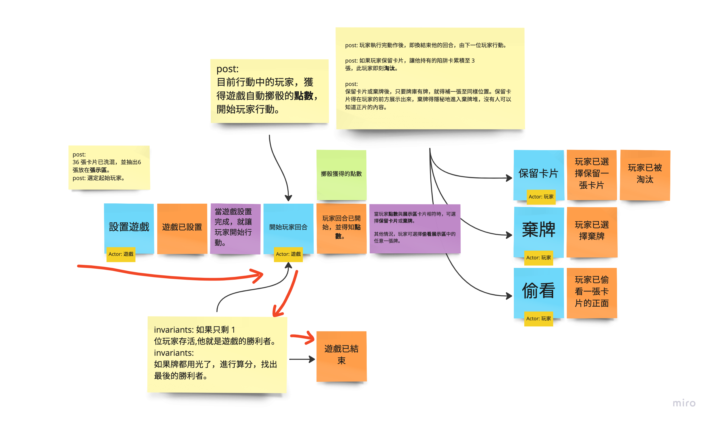

## 遊戲實作：玩命起司

這個專案中是放置 [遊戲微服務計劃](https://waterball.notion.site/Game-as-a-Service-e636a20876e6484ba0b758fdeaee06f0) 練習程式的地方。

這次選擇的是一個複雜度不高的 `玩命起司`，讓自己學習的焦點放在不同階段的銜接。

## 參考文件

https://sordid-bearskin-bdd.notion.site/78a11d09b5054697831e97019733aca3

* Event Storming 
* Example Mapping
* OOA 

https://sordid-bearskin-bdd.notion.site/Walking-Skeleton-1f6733acd37a4ca8a0ca91b73a2d2dc4
* 進入實作的 Walking Skeleton

